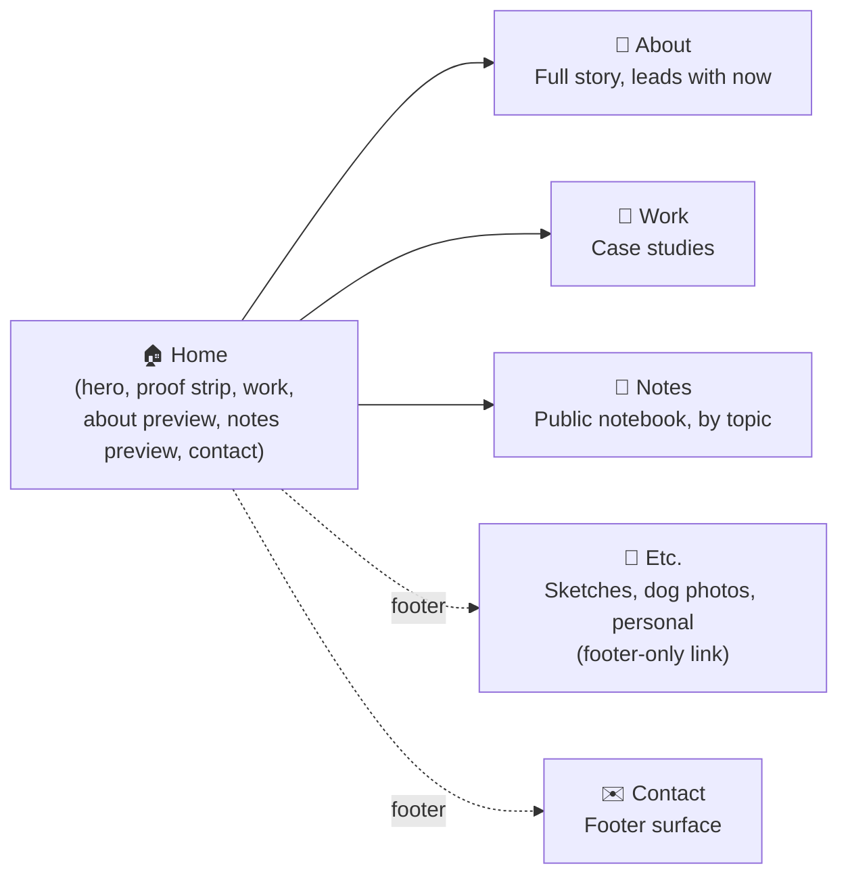
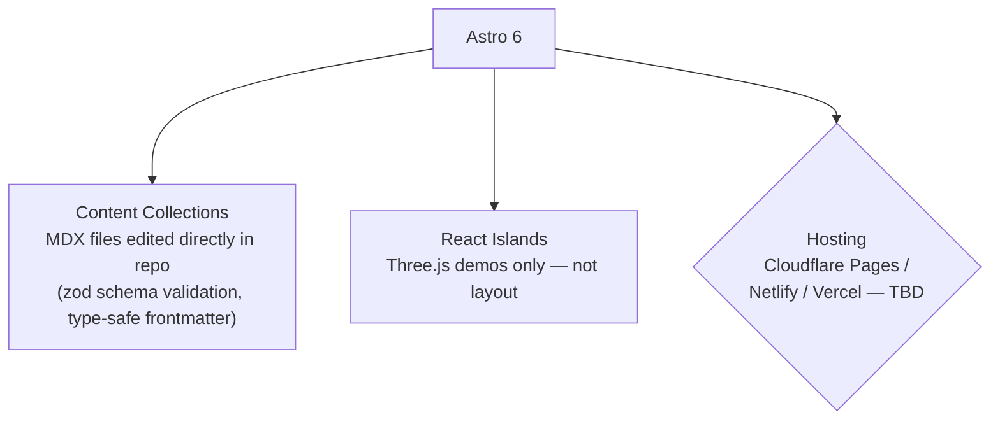

# 🧭 Personal Site — Project Overview

> A calling card for Head of Delivery roles at product companies. Editorial, typography-led, built in Astro.

---

## 🎯 Purpose & Audience

**Primary:** Senior hiring managers at product companies — Head of Delivery inbound.
**Secondary:** Peers, collaborators, occasional freelance enquiry.

**Positioning:** A technical delivery leader who came up through the code and still ships it.
Not a generalist developer. Not a freelancer. The 3D/visual work signals range — it is **not** a hire-me-for-3D pitch.

---

## 👤 About Darran

| | |
|---|---|
| **Role** | Technical Delivery Lead, Jarilo Design (web agency) |
| **Path** | Hospitality (10 yrs, teams of 50+) → self-taught dev (The Odin Project, lockdown) → Jarilo Web Developer (2022) → Technical Operations Lead (2024) |
| **Scope now** | Delivery oversight across design, dev, QA, account management, consultancy |
| **Also** | Animation degree — real 3D chops (Three.js, Blender) |

**Distinctive angle:** the arc (hospitality → self-taught dev → delivery lead) + AI-augmented delivery work.

### 📊 Proof points
- **350+** projects delivered annually
- **41%** team output increase from AI adoption
- **20%** reduction in project timelines
- **90+** projects shipped as a developer, pre-promotion

---

## 🗺️ Site Structure

### Page notes
- **About** — full story, leads with *now*, arc as backstory
- **Work** — priority order: AI adoption rollout → internal product → Three.js piece
- **Notes** — not a blog. No dates. Organised by topic tag. Rough + polished coexist.
- **Etc.** — deliberately hidden depth, linked from footer only
- **Contact** — likely just footer, not a standalone page

---

## 🏠 Homepage Anatomy

1. **Hero** — name dominant. Positioning line: *"Technical delivery lead at Jarilo Design. Self-taught, hospitality-raised, still ships code."* Current-focus line: *"Currently shipping 350+ projects a year and figuring out what AI-augmented delivery actually looks like in practice."*
2. **Proof strip** — 4 metrics, numbers dominant / labels light
3. **Selected Work** — 3–4 items, list (not cards), category tag + title + one-liner. Thumbnails only on visual/technical items. Muted tag colours — label, don't shout.
4. **About preview** — 3 short paragraphs, no photo, left-aligned to main grid, "More about me →"
5. **Notes preview** — *"A public notebook — thoughts, hacks and lessons, primarily for myself."* 3–4 recent, topic tags, titles dominant, no dates, "All notes →"
6. **Footer** — Email / GitHub / LinkedIn (plain text) · Etc. (far right) · "Built with Astro" · copyright

---

## 📓 Notes / Notebook Framing

Not a blog — a public notebook, primarily for Darran. No dates, topic-tagged, rough and polished side by side.

**Content buckets (priority order):**
1. 🤖 AI-augmented workflows — *highest priority; the AI adoption rollout is the strongest single piece to publish*
2. 🔧 Delivery / process thinking
3. 🧑‍💻 Technical-leader-who-still-codes perspective
4. 📚 Occasional career / learning reflection

---

## 🎨 Design Direction

**References:** [Maggie Appleton](https://maggieappleton.com/) · [Brian Lovin](https://brianlovin.com/) · [Rauno Freiberg](https://rauno.me/) · [Paul Stamatiou](https://paulstamatiou.com/)

| Element | Direction |
|---|---|
| Background | Warm off-white |
| Accent | Muted terracotta (nod to earlier orange-heavy site) |
| Text | Dark, not black |
| Headings | Serif — **Fraunces** leaning choice (closest free alt to Canela Deck) |
| Body | Readable sans |
| Spacing | Generous whitespace, with 1–2 confident focal elements (hero name, section headings) |
| Motion | View transitions if tasteful |
| Mode | Light primary; dark mode welcome if done well |

**Explicitly avoid:** gradient backgrounds, mouse-follow effects, parallax, scroll-jacking, testimonials, services section, skills cloud, newsletter signup, contact form.

**🎥 Reference:** [Scroll-driven animations without any JS](https://www.youtube.com/watch?v=bBh8fpb3h5c) — CSS-only technique, relevant given the no-scroll-jacking/no-parallax constraint above.

---

## ⚙️ Technical Stack

**No CMS.** Content is just MDX/Markdown files in the repo, edited in your normal editor and reviewed via git diff/PR — appropriate for a single-author site, and one less dependency to track through Astro version bumps.

**Non-negotiables:**
- Semantic HTML, accessible contrast + focus states
- Mobile-considered, not just responsive
- React islands reserved for genuinely interactive elements only

---

## 🚀 Starting Point

1. Project structure scaffolded (Astro 6)
2. Content collections defined — `Work`, `Notes` (MDX, zod schema, no CMS layer)
3. Homepage rendering with placeholder content
4. Iterate on real content + design polish

---

## ❓ Open Decisions

- [ ] Hosting: Cloudflare Pages vs Netlify vs Vercel
- [ ] Font pairing implementation for Fraunces (headings) + sans body
- [ ] Dark mode — pursue now or post-launch
- [ ] Confirm comfort writing Notes/Work entries as raw MDX in an editor, now that there's no CMS admin UI
